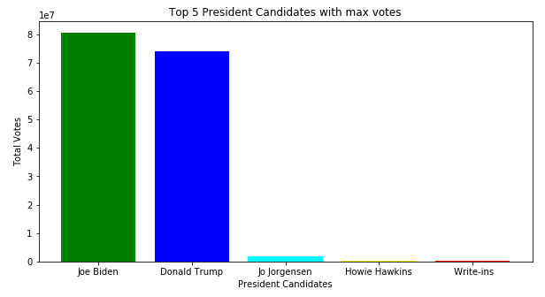
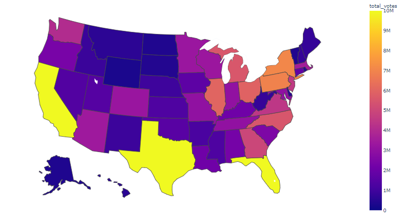
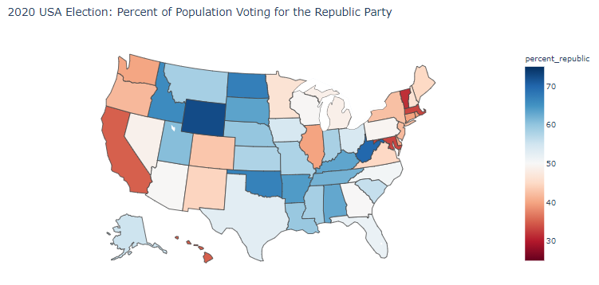
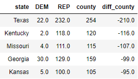

# UNITED STATES’ PRESIDENTIAL ELECTIONS 2020

The United States(US) is the only country with a continuous democracy for more than 200years. However, the US is more accurately defined as a constitutional republic. “Constitutional” refers to the fact that the government in the US is based on a Constitution, which is the supreme law of the US.

The US elects its president every four years. The most recent election is the 2020 elections, which generated alot of attention around the world. Although every citizen, who is eligible can vote, a presidential candidate needs 270 electoral college votes to win the presidency. There are two major parties in the US; Republican party and Democrat party. The current president is Joe Biden, a Democrat won with 279 electoral college votes. The former president,  Donald Trump is a Republican, while his predecessor, Barack Obama is a Democrat.

## Data Analysis
Analysis performed on US election results data and made some EDA of the total votes distribution among candidates, parties and counties.

### State wise US Voting 

### 2020 USA Election: Percent of Population Voting for the Republic Party
In 2020, Republican party candidate Joe Biden won the presidential election with 279 electoral college votes. The following figure shows the percentage of votes from each state towards Republican party.

### Top 5 states with max number of Counties which made the difference
The Democratic party got very less wins in the **Texas**, **Kentucky**, **Missouri**, **Georgia** and **Kansas** states which are having highest number of counties, which made the difference.

